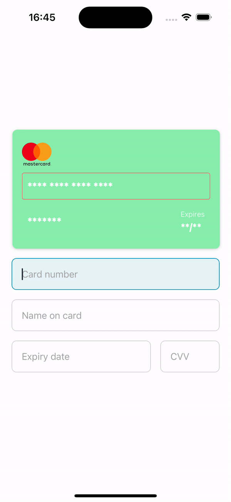

# Credit Card Component

This is a basic credit card component built using React Native, React Native Reanimated and NativeBase. It displays a credit card with front and back views, and allows the user to input their card details.
<br>
<br>
<br>




## Installation

1. Clone the repository:

```bash
git clone https://github.com/alexsandersarmento/react-native-flip-card.git
```

2. Install the dependencies:

```bash
cd react-native-flip-card
yarn install
```

3. Start the development server:

```bash
expo start
```

## Usage

The `CreditCard` component is the main component that renders the credit card with input fields. It is used in the `App` component.

The component structure is as follows:

- `CreditCard` (Main component)
  - `CreditCardFront` (Displays the front view of the credit card)
  - `CreditCardBack` (Displays the back view of the credit card)
  - `CreditCardInput` (Custom input component for card details)
  - `CreditCardImage` (Displays the card brand logo)

You can customize the component by modifying the styles and adding additional functionality as per your requirements.

## Dependencies

The project uses the following dependencies:

- `react`
- `react-native`
- `native-base`
- `react-native-reanimated`

Make sure to have these dependencies installed in your project.

That's it! You can now use the credit card component in your project. Feel free to customize and enhance it further.

If you have any questions or need further assistance, please let me know.